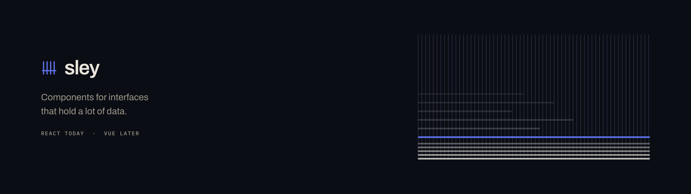

<picture>
  <source media="(prefers-color-scheme: dark)" srcset=".github/banner-dark.png">
  <source media="(prefers-color-scheme: light)" srcset=".github/banner-light.png">
  
</picture>

## About

Sley UI is a component registry for React. It covers the interfaces that hold a lot of data: tables, filter bars, command palettes, side panels and long forms.

The components are not an npm dependency. A command copies the source files into your project. You own the code from that point. You can read it, change it, and keep your changes.

## Install

```sh
npx sley-ui init
npx sley-ui add table
```

Install it globally and the command shortens to `sley`.

`init` reads your project. It finds the framework, the path alias and the stylesheet that pulls Tailwind in, then writes the token block as a file of its own. Vite and Next are both supported. `add` writes a component and everything it imports. If you have already edited one of those files, it keeps your version and tells you.

## Why

I build data-heavy internal tools for a living, and every component library I reached for was designed for a marketing page. They look right with eight elements on a screen. At two hundred the padding eats the viewport, the rows drift out of step with the controls beside them, and I spend more time overriding the library than using it.

So I started from the dense case. One attribute on the root element moves every component between comfortable, compact and dense. Row height, control height, padding and label size all move together. It is CSS custom properties, so it costs no JavaScript.

A narrow screen hides nothing. The table scrolls instead. Which columns matter is your call, not mine.

Underneath: Ark UI for behaviour, Tailwind CSS v4 for the token layer. Each component is readable TypeScript. There is no runtime style engine.

## Updates

You own the code, so a normal registry cannot update it. Sley UI records the source hash of every file that it writes, and the exact registry version it came from. Every published version keeps its own path on the registry, so the version you installed is still there a year later. The `update` command does a three way merge across the old registry version, the new registry version, and your edited file. Your changes stay.

## Status

Early development. The design language is settled, and the component set is built on it: table, command palette, filter bar, field set, dialog, popover, toast, tabs, tooltip, select, panel and empty state. The docs site is live at [sley-ui.dev](https://sley-ui.dev), and it carries a running demo application. The registry is served from the same place, at version 0.1.0, and `init` and `add` install from it on a fresh Vite app and a fresh Next app. The CLI itself is not published yet, so the commands above do not run until it is. `update` comes next. Expect breaking changes.

To read the docs locally, clone this repo and run `npm install && npm run dev -w docs`.

## Licence

MIT. Isfaaq M. F. Emambocus.
